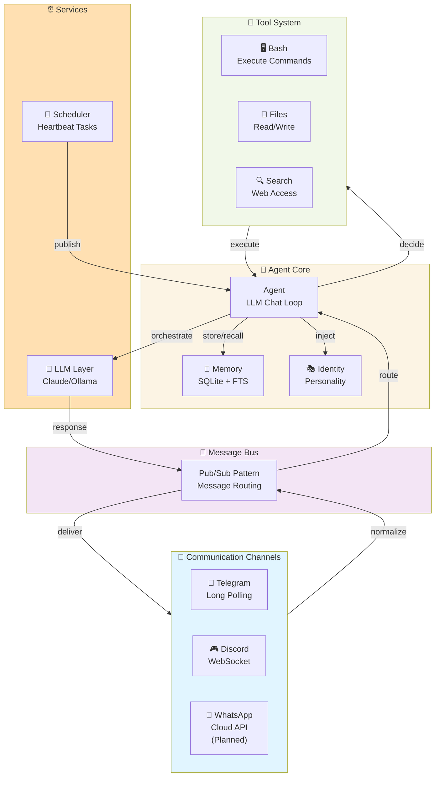
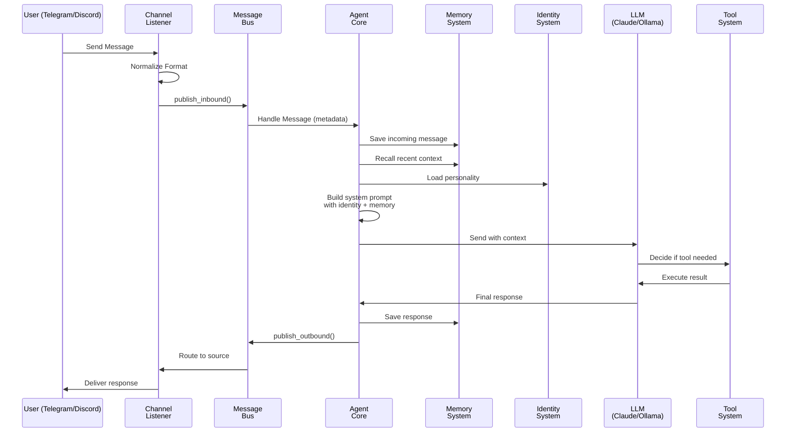

# Nucleo ♎

<!-- Replace YOUR_ORG with your GitHub organization in the badges below -->
[](https://github.com/ReleaseOnMonday/nucleo)
[](https://www.python.org/)
[](LICENSE)
[](https://github.com/ReleaseOnMonday/nucleo/actions)
[](https://codecov.io/gh/ReleaseOnMonday/nucleo)
[](https://codecov.io/github/ReleaseOnMonday/nucleo)
[](https://github.com/ReleaseOnMonday/nucleo)

Ultra-lightweight AI assistant in Python with multi-channel support for Telegram, Discord, and more. Inspired by modern distributed AI architectures.

---

## 🖇️ Repository Setup

This README and configuration files use placeholders for your GitHub organization. To use them with your repo:

### Update Badges & Links

1. **README.md** (badges at top):

2. **config.example.json** (if needed)

3. **.github/workflows/ci.yml** (if needed)

### Connect Codecov

For code coverage badges to work:

1. Visit [codecov.io](https://codecov.io)
2. Sign in with GitHub
3. Select your repository
4. Copy the coverage badge URL
5. Update the README badge URL

### Enable GitHub Actions

1. Push code to GitHub
2. Go to `Settings` → `Actions` → `General`
3. Ensure "Actions permissions" is enabled
4. Workflow will run automatically on next push

---

## 🎉 Latest Release (v1.0) - February 2026

**Major Features Added:**
- 🧠 **Persistent Memory System**: SQLite-backed conversation memory with hybrid search (keyword FTS + vector-ready)
- 🎭 **Identity System**: Define agent personality (IDENTITY.md, SOUL.md, USER.md) for consistent behavior across channels
- ⏰ **Heartbeat/Scheduler**: Autonomous task scheduling with cron expressions for proactive agent actions
- 🚀 **Setup Wizard**: Interactive `python main.py setup` for zero-config onboarding
- 🌐 **Multi-Channel Gateway**: Unified Telegram + Discord support with message normalization
- 📦 **Enhanced LLM Support**: Auto-detection between Ollama (offline) and Claude API

**Breaking Changes**: None - full backward compatibility maintained

**Migration**: Existing config.json files continue to work; new features are opt-in (enabled by default)

---

## ✨ Features

### Core
- 🪶 **Ultra-Lightweight**: <100MB memory footprint, no heavy frameworks
- ⚡ **Fast**: <3 seconds startup time
- 🔧 **Modular**: Extensible tool and channel architecture
- 💬 **Multi-Channel**: Deploy to Telegram, Discord, and more
- 🎯 **Smart**: Claude AI with tool orchestration

### Intelligent Memory & Identity
- 🧠 **Persistent Memory**: Automatic conversation storage with hybrid search (keyword FTS + vector-ready embedding support)
- 🎭 **Identity System**: Define agent personality, values, and user context (IDENTITY.md, SOUL.md, USER.md)
- 📚 **Context Injection**: Recent memories + identity automatically included in LLM prompts
- 👤 **Per-User Memory**: Separate memory space per user with statistics tracking

### Autonomous Operation
- ⏰ **Task Scheduler**: Cron-based autonomous tasks (scheduled messages, periodic checks, notifications)
- 💬 **Proactive Messaging**: Agent can send messages without user trigger via HEARTBEAT.md
- 🔄 **Heartbeat System**: Define recurring tasks for autonomous agent behavior

### Tool Orchestration & Capabilities
- 🧠 **Tool Use**: Execute tools (bash, files, search) with AI decision-making
- 🌐 **Web Search**: Real-time information retrieval via Brave API
- 📁 **File Operations**: Read, write, and analyze files safely
- 🛡️ **Sandboxed Bash**: Execute shell commands with allowlist
- 🔄 **Streaming**: Real-time response streaming

### Multi-Channel & Configuration
- 👥 **Multi-User**: Handle concurrent users across channels
- 🎛️ **Setup Wizard**: Interactive `python main.py setup` for zero-config onboarding
- 📝 **Conversation Memory**: Persistent multi-turn chat history per user
- 🔐 **Access Control**: Allowlist-based user/guild restrictions

## Quick Start

### 1. Install Dependencies

```bash
pip install -r requirements.txt
```

> 💡 **Optional**: For web search support, see [optional dependencies](#optional-dependencies) section

### 2. Configure

Create `config.json` from the example:

```bash
cp config.example.json config.json
```

Edit `config.json` and add your API keys:

```json
{
  "agent": {
    "model": "claude-3-5-sonnet-20241022",
    "max_tokens": 4096,
    "temperature": 0.7,
    "system_prompt": "You are a helpful AI assistant. Be concise and practical."
  },
  "providers": {
    "anthropic": {
      "api_key": "sk-ant-..."
    }
  },
  "tools": {
    "bash": {
      "enabled": true,
      "allowed_commands": ["ls", "cat", "grep", "find", "echo"]
    },
    "search": {
      "enabled": false,
      "api_key": ""
    },
    "files": {
      "enabled": true,
      "workspace": "./workspace"
    }
  }
}
```

### 3. Setup (Optional but Recommended)

Run the interactive setup wizard:

```bash
python main.py setup
```

This will:
- Detect available LLMs (Ollama, Claude API)
- Configure Telegram and Discord channels
- Set up tools (bash, search, files)
- Create identity files for customization

### 4. Run

**Interactive Chat**
```bash
python main.py chat
```

**Single Query**
```bash
python main.py query "What is 2+2?"
```

**Start Gateway** (Telegram/Discord)
```bash
python main.py gateway
```

See [GATEWAY.md](GATEWAY.md) for detailed channel setup and configuration.

---

## 🚀 Gateway - Multi-Channel AI Assistant

Deploy Nucleo across messaging platforms with a unified interface.

### Supported Channels

| Platform | Status | Access | Setup Time |
|----------|--------|--------|------------|
| **Telegram** | ✅ Ready | Long Polling | 5 min |
| **Discord** | ✅ Ready | WebSocket | 10 min |
| **Slack** | 🔄 Coming Soon | Socket Mode | - |
| **WhatsApp** | 🔄 Planned | Cloud API | - |

### Quick Gateway Setup

#### Telegram

1. Open Telegram → Search `@BotFather`
2. Send `/newbot` and follow prompts
3. Copy bot token to `config.json`:

```json
{
  "channels": {
    "telegram": {
      "enabled": true,
      "token": "YOUR_BOT_TOKEN",
      "allowed_users": []
    }
  }
}
```

4. Start: `python main.py gateway`

#### Discord

1. Go to https://discord.com/developers/applications
2. Create "New Application" → Go to "Bot" → "Add Bot"
3. Copy token to `config.json`:

```json
{
  "channels": {
    "discord": {
      "enabled": true,
      "token": "YOUR_BOT_TOKEN",
      "allowed_users": []
    }
  }
}
```

4. Invite bot to server via OAuth2 URL Generator
5. Start: `python main.py gateway`

### Gateway Features

- 🔀 **Unified Interface**: Same Agent across all channels
- 👥 **Multi-User**: Handle concurrent users
- 🛡️ **Access Control**: Allowlist users by ID
- 📁 **File Support**: Upload/download files per channel
- 🎯 **Smart Routing**: Messages automatically route to correct channel
- 🔄 **Conversation History**: Per-user chat memory
- ⚡ **Streaming**: Real-time response delivery

### Advanced Gateway Usage

See [GATEWAY.md](GATEWAY.md) for:
- Detailed channel configuration
- Creating custom channels
- Production deployment tips
- Troubleshooting guide
- Performance optimization

---

## 🏗️ Architecture

### System Design (Pictorial)



### File Structure

```
nucleo/
├── agent.py                 # Core agent with tool orchestration
├── config.py                # Configuration management
├── llm.py                   # LLM client (Anthropic/Ollama)
├── memory.py                # 💾 Persistent memory with SQLite & hybrid search
├── identity.py              # 🎭 Identity system (IDENTITY.md, SOUL.md, USER.md)
├── scheduler.py             # ⏰ Task scheduler with cron support
├── setup.py                 # 🚀 Interactive setup wizard
├── tools/
│   ├── base.py              # Tool interface
│   ├── bash.py              # Shell execution
│   ├── files.py             # File operations
│   └── search.py            # Web search
└── channels/
    ├── base.py              # Channel interface
    ├── manager.py           # Channel orchestration
    ├── bus.py               # Message bus (pub/sub)
    ├── telegram.py          # Telegram integration
    ├── discord.py           # Discord integration
    └── message.py           # Message types

workspace/
├── IDENTITY.md              # Agent identity (who are you?)
├── SOUL.md                  # Agent personality (values & tone)
├── USER.md                  # User profile guidance
├── HEARTBEAT.md             # Scheduled autonomous tasks
└── (files & data)           # Working directory for files tool
```

### Message Flow & Data Pipeline



---

## � Advanced Features

### Persistent Memory System

Automatically saves and recalls conversation context:

```json
{
  "memory": {
    "enabled": true,
    "db_path": null,
    "max_history_messages": 50
  }
}
```

**Features:**
- SQLite database with full-text search (FTS5)
- Per-user memory isolation
- Keyword extraction and deduplication
- Importance levels (1-5) for prioritization
- Vector embedding support (future)

See memory auto-injection in agent prompts: Agent recalls 3 most recent memories for each conversation.

### Identity & Personality System

Define consistent agent behavior across channels:

- **IDENTITY.md** - Name, role, capabilities, purpose
- **SOUL.md** - Values, personality, communication style, boundaries
- **USER.md** - User profile, preferences, accessibility notes

These are automatically loaded and injected into the system prompt.

### Autonomous Task Scheduling

Schedule recurring agent actions via HEARTBEAT.md:

```yaml
task_name: "Morning Standup"
schedule: "0 9 * * *"
enabled: true
action: "send_to_channel"
channel: "telegram"
content: "Good morning! What's on your agenda?"
```

Supports cron expressions, multi-channel targets, and conditional logic.

### Interactive Setup Wizard

Zero-config onboarding:

```bash
python main.py setup
```

Guides through:
- LLM selection (Claude/Ollama/Auto-detect)
- Channel setup (Telegram, Discord)
- Tool configuration (Bash, Search, Files)
- API key collection
- Identity file creation

---

## �📦 Dependencies

**Core (required)**
- `anthropic` - LLM provider
- `httpx` - Async HTTP client

**Channels (optional)**
- `python-telegram-bot` - Telegram support
- `discord.py` - Discord support

**Tools (optional)**
- `brave-search` - Web search *(requires separate install - see [requirements-optional.txt](requirements-optional.txt) due to dependency conflicts)*

**Development**
- `pytest` - Testing framework
- `pytest-cov` - Code coverage reporting
- `ruff` - Code linting and formatting

### Optional Dependencies

To use web search functionality, install from [requirements-optional.txt](requirements-optional.txt):

```bash
# Option 1: Create isolated venv for web search
python -m venv venv-search
source venv-search/bin/activate  # or `venv-search\Scripts\activate` on Windows
pip install -r requirements-optional.txt

# Option 2: Install compatible versions directly
pip install httpx==0.25.2 brave-search==0.1.8
```

⚠️ Note: `brave-search` has a tight dependency on `httpx<0.26.0`, which conflicts with the main project's `httpx>=0.27.0` requirement for newer async features. Using an isolated venv is recommended.

---

## 🔧 Extending Nucleo

### Creating Custom Tools

Extend `BaseTool`:

```python
from nucleo.tools import Tool

class MyTool(Tool):
    async def execute(self, **kwargs):
        # Your implementation
        return {"result": "data"}
    
    def to_anthropic_tool(self):
        return {
            "name": "my_tool",
            "description": "What it does",
            "input_schema": {...}
        }
```

### Creating Custom Channels

Extend `BaseChannel`:

```python
from nucleo.channels import BaseChannel

class MyChannel(BaseChannel):
    @property
    def name(self) -> str:
        return 'mychannel'
    
    async def start(self) -> None:
        self._running = True
        # Start listening
    
    async def stop(self) -> None:
        self._running = False
    
    async def send(self, message) -> None:
        # Send via your platform
        pass
```

See [GATEWAY.md](GATEWAY.md#advanced-usage) for detailed examples.

---

## ⚙️ Configuration

Nucleo uses JSON configuration. Key sections:

### Agent Settings
```json
{
  "agent": {
    "model": "claude-3-5-sonnet-20241022",
    "max_tokens": 4096,
    "temperature": 0.7,
    "max_tool_iterations": 10,
    "system_prompt": "Your custom system prompt"
  }
}
```

### Tool Configuration
```json
{
  "tools": {
    "bash": {
      "enabled": true,
      "allowed_commands": ["ls", "grep", "find"],
      "max_output_length": 10000
    },
    "search": {
      "enabled": false,
      "api_key": "your-brave-search-key-optional",
      "max_results": 5
    },
    "files": {
      "enabled": true,
      "workspace": "./workspace",
      "max_file_size_mb": 10
    }
  }
}
```

### Channel Configuration
```json
{
  "channels": {
    "telegram": {
      "enabled": false,
      "token": "",
      "allowed_users": []
    },
    "discord": {
      "enabled": false,
      "token": "",
      "allowed_guilds": []
    }
  }
}
```

### Memory & Identity Configuration
```json
{
  "memory": {
    "enabled": true,
    "db_path": null,
    "max_history_messages": 50
  },
  "identity": {
    "enabled": true,
    "workspace_path": null
  },
  "scheduler": {
    "enabled": false,
    "heartbeat_file": "./workspace/HEARTBEAT.md",
    "timezone": "UTC"
  }
}
```

See `config.example.json` for all available options.

---

## 📊 Performance Benchmarks

Nucleo is optimized for minimal resource usage:

| Metric | Value | Notes |
|--------|-------|-------|
| Memory (Idle) | ~50MB | Python base + imports |
| Memory (Active) | ~100MB | With one channel + agent |
| Startup Time | ~2-3s | Module loading only |
| Response Latency | ~1-5s | LLM generation + tool exec |
| Concurrent Users | Unlimited* | Rate-limited by LLM API |
| File Operations | Safe | Sandboxed to workspace dir |
| Tool Execution | Controlled | Allowlist-based command safety |

*Practically limited by Anthropic API rate limits (~25k tokens/min)

---

## 🖥️ System Requirements

- **Python**: 3.10+
- **Memory**: 256MB+ (512MB recommended for gateway mode)
- **Disk**: 200MB (mostly for dependencies)
- **Network**: Required
- **OS**: Linux, macOS, Windows (via WSL)

---

## 🚀 Deployment

### Docker

```dockerfile
FROM python:3.10-slim
WORKDIR /app
COPY requirements.txt .
RUN pip install -r requirements.txt
COPY . .
CMD ["python", "main.py", "gateway"]
```

### Docker Compose

```yaml
services:
  nucleo:
    build: .
    environment:
      - NUCLEO_CONFIG=/etc/nucleo/config.json
    volumes:
      - ./config.json:/etc/nucleo/config.json
      - ./workspace:/app/workspace
    restart: unless-stopped
```

### Command Line

```bash
# Set config path
export NUCLEO_CONFIG=/etc/nucleo/config.json

# Start gateway
python main.py gateway

# Enable debug logging
export DEBUG=1 python main.py gateway
```

---

## 📚 Examples

### Simple Chat Loop with Memory

```python
from nucleo import Agent, Config

config = Config().load()
agent = Agent(config)  # Memory auto-enabled if config allows

user_id = "user123"

while True:
    user_input = input("You: ")
    response = ""
    
    # Agent automatically saves to memory and recalls context
    async for chunk in agent.chat(
        user_input,
        stream=True,
        metadata={'sender_id': user_id, 'platform': 'cli'}
    ):
        response += chunk
    
    print("Agent:", response)
    
    # Check memory stats
    if agent.memory:
        stats = agent.memory.get_stats(user_id)
        print(f"Memories: {stats['total_memories']}")
```

### Using Tools with Memory Context

```python
# Agent automatically uses tools when appropriate
# Memory context is auto-injected into prompt
async for chunk in agent.chat(
    "List files in workspace and search for 'nucleo'",
    stream=True,
    metadata={'sender_id': user_id, 'platform': 'telegram'}
):
    print(chunk, end="", flush=True)
```

### Gateway with Multiple Channels & Persistent Memory

```python
from nucleo.channels import ChannelManager, TelegramChannel, DiscordChannel

manager = ChannelManager(config, agent.bus)
manager.register_channel(TelegramChannel(config, agent.bus))
manager.register_channel(DiscordChannel(config, agent.bus))

# Agent memory persists across all channels for each user
await manager.start()
```

### Schedule Autonomous Tasks

Create `/workspace/HEARTBEAT.md` with:

```yaml
task_name: "Daily Report"
schedule: "0 18 * * *"
enabled: true
action: "send_to_channel"
channel: "telegram"
content: "Daily summary: You have {{memory_count}} conversations saved"
```

Then enable in config:

```json
{
  "scheduler": {
    "enabled": true,
    "heartbeat_file": "./workspace/HEARTBEAT.md"
  }
}
```

See [GATEWAY.md](GATEWAY.md) for more advanced examples.

---

## 🛠️ Development

### Setup Dev Environment

```bash
# Install with dev dependencies
pip install -r requirements.txt

# Format code
ruff format nucleo/

# Lint
ruff check nucleo/

# Run tests with coverage
pytest test_nucleo.py -v --cov=nucleo --cov-report=html --cov-report=term

# View coverage report
open htmlcov/index.html  # macOS
# or
xdg-open htmlcov/index.html  # Linux
```

### Code Coverage & Testing

Nucleo uses **pytest** for unit testing and **pytest-cov** for code coverage reporting.

**Local Coverage Report:**
```bash
# Run tests and generate HTML coverage report
pytest test_nucleo.py --cov=nucleo --cov-report=html

# View in browser
open htmlcov/index.html
```

**Coverage Targets:**
- Minimum: 70% overall code coverage
- Goal: 85% by v1.5
- Critical paths (agent.py, channels/): 90%+

**Continuous Integration:**

Every push and PR runs automated tests on:
- ✅ Python 3.10, 3.11, 3.12
- ✅ Code linting (ruff)
- ✅ Code formatting checks
- ✅ Unit tests with coverage
- ✅ Coverage reports to Codecov

Build status and coverage badges are displayed at the top of this README.

**Coverage Badges:**
-  - Build pass/fail status
-  - Code coverage percentage

### Contributing

We welcome contributions! Areas to enhance:

- **New Channels**: Slack, WhatsApp, Matrix, IRC
- **New Tools**: Calculator, SQL, APIs
- **Features**: Voice support, rich formatting, reactions
- **Performance**: Response caching, optimizations
- **Docs**: Examples, tutorials, API docs

See [CONTRIBUTING.md](CONTRIBUTING.md) for guidelines (coming soon).

---

## ❓ FAQ

**Q: How do I restrict access to specific users?**
A: Set `allowed_users` in channel config with user IDs. Empty list allows all users.

**Q: Can I use a different LLM provider?**
A: Extend `LLMClient` in `nucleo/llm.py`. Currently supports Anthropic; OpenAI/OpenRouter support planned.

**Q: What's the rate limit?**
A: Limited by your Anthropic API plan. Free tier: ~25k tokens/min. Monitor in console logs.

**Q: Can I run multiple Nucleo instances?**
A: Yes! Each instance is stateless. Use a shared state backend for multi-instance chat history.

**Q: How do I add a new tool?**
A: Create a class extending `BaseTool`, implement `execute()` and `to_anthropic_tool()`, add to agent tools.

**Q: Is there a web interface?**
A: Not yet. Web dashboard planned for future version. Currently CLI and chat channels only.

**Q: Can I use this commercially?**
A: Yes! MIT license allows commercial use. See [LICENSE](LICENSE) for details.

**Q: How do I debug issues?**
A: Check console logs first. Enable verbose logging with `DEBUG=1`. See [GATEWAY.md](GATEWAY.md#troubleshooting).

---

## 🤝 Community

- **Issues**: Report bugs or feature requests on GitHub
- **Discussions**: Share ideas and ask questions
- **Contributing**: We welcome pull requests!
- **Support**: Check docs or open an issue

---

## 📖 Documentation

- [README.md](README.md) - This file
- [GATEWAY.md](GATEWAY.md) - Channel deployment and usage
- [ARCHITECTURE.md](ARCHITECTURE.md) - Technical deep dive
- [CI.md](CI.md) - Continuous integration and code coverage setup
- [QUICKSTART.md](QUICKSTART.md) - Getting started guide
- [config.example.json](config.example.json) - Configuration reference

---

## 🔗 Resources

- [Claude API Documentation](https://docs.anthropic.com/)
- [Python Telegram Bot](https://python-telegram-bot.readthedocs.io/)
- [Discord.py Documentation](https://discordpy.readthedocs.io/)
- [Brave Search API](https://api.search.brave.com/)

---

## 📝 License

MIT License - see [LICENSE](LICENSE) file for details

**Copyright © 2026 Nucleo Contributors**

Permission is hereby granted, free of charge, to any person obtaining a copy
of this software and associated documentation files (the "Software"), to deal
in the Software without restriction, including without limitation the rights
to use, copy, modify, merge, publish, distribute, sublicense, and/or sell
copies of the Software, and subject to the following conditions:

The above copyright notice and this permission notice shall be included in all
copies or substantial portions of the Software.

---

**Made with 🔧 for developers who value simplicity and efficiency**

⭐ Like Nucleo? Consider starring the repository!

